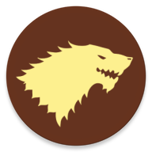

# MHP - Mobile-App Coding Challenge

Android App as solution for the [Mobile-App Coding Challenge](https://github.com/MHP-A-Porsche-Company/coding-challenges/blob/master/Mobile/README.md)

## Solution

The solution was written using [Android Studio Dolphin | 2021.3.1 Patch 1](https://developer.android.com/studio/).

The App is developed using Clean Architecture to divide responsibilities into domain, data and presentation layers.

The domain layer avoids all external dependencies and is uses by the other layers.

The data layer follows Googles DataSource approach with remote and local differentiation. This solution provides only the remote part.

The presentation layer follows MVVM and introduces Atomic Design for the Composable views. Material 3 is used as a base design system. Navigation implemented using Compose Navigation. Composable views are tested via instrumentation and screenshots.

An Injector is used to provide dependencies as constructor parameters. 

Third-party dependencies have been avoided if possible.

In general the solution aims to provide a testable and modular code base that is open for extension.

## Usage

Import the project as Gradle project in Android Studio. Build it and run the app on the desired device or emulator.

Test the app with `./gradlew check` and `./gradlew connectedCheck`.

NOTE: The screenshot tests are screen density dependent. So calling `./gradlew connectedCheck` might fail if the device density is different to the one they have been taken. They have been created for my phone and a Pixel XL 5.5" emulator.

### Create new screenshot for desired device density:

Open `ComposeTestScreenshot.kt` in folder `app-android/src/androidTest/java/com/wolfmontwe/mhp/challenge/mobile/android/app/test/compose/` and change `saveAsExpected = true`

Then run `./gradlew connectedCheck` to generate the screenshots and `./copy_screenshot.sh` to copy them in the project androidTest assets folder.

Disable the flat and run again.

## Changelog

All notable changes to this project are documented in the [changelog](CHANGELOG.md).

## Versioning

[Semantic Versioning](http://semver.org/) is used as a guideline for versioning.

## Copyright

Copyright (c) 2022 Wolf-Martell Montwé.
